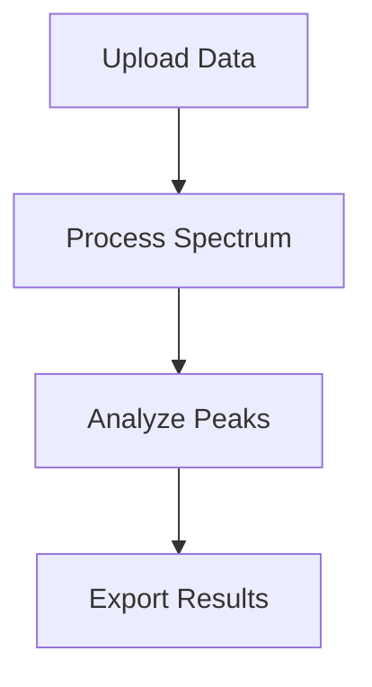

# NMR Platform Documentation

This directory contains the complete documentation for the NMR Platform, built with [VitePress](https://vitepress.dev/).

## 📖 Documentation Structure

```
docs/
├── .vitepress/           # VitePress configuration
│   ├── config.js         # Main configuration
│   └── theme/            # Custom theme
├── getting-started/      # Installation and setup guides
├── user-guide/          # User documentation
├── api/                 # API reference
├── developer/           # Developer guides
├── contributing.md      # Contribution guidelines
└── index.md            # Homepage
```

## 🚀 Quick Start

### Prerequisites

- Node.js 18+ 
- npm or yarn

### Installation

```bash
# Install dependencies
npm install

# Start development server
npm run docs:dev
```

The documentation will be available at `http://localhost:5173`

### Building for Production

```bash
# Build static files
npm run docs:build

# Preview production build
npm run docs:preview
```

## 📝 Writing Documentation

### File Organization

- Use descriptive file names with kebab-case
- Organize content logically in directories
- Include an `index.md` file in each directory for overview

### Markdown Features

VitePress supports enhanced Markdown with:

- **Code syntax highlighting**
- **Custom containers** for tips, warnings, etc.
- **Mermaid diagrams** for flowcharts
- **Math expressions** with KaTeX
- **Vue components** in Markdown

### Examples

#### Code Blocks

```bash
# Install VitePress
npm install -D vitepress
```

```php
<?php
// PHP example
$dataset = new Dataset();
$dataset->save();
```

#### Custom Containers

::: tip
This is a helpful tip for users.
:::

::: warning
This is a warning about potential issues.
:::

::: danger
This is a critical warning.
:::

#### Mermaid Diagrams



### Content Guidelines

1. **Clear and Concise**: Write in simple, clear language
2. **User-Focused**: Address user needs and workflows
3. **Step-by-Step**: Provide detailed instructions
4. **Examples**: Include practical examples and code samples
5. **Screenshots**: Add visual aids where helpful
6. **Cross-References**: Link to related documentation

## 🎨 Customization

### Theme Configuration

The documentation uses a custom theme extending VitePress default theme:

- **Colors**: Brand colors matching the application
- **Components**: Custom Vue components for special content
- **Styling**: Additional CSS for NMR-specific styling

### Adding Custom Components

Create Vue components in `.vitepress/theme/components/`:

```vue
<!-- CustomComponent.vue -->
<template>
  <div class="custom-component">
    <!-- Component content -->
  </div>
</template>
```

Register in `.vitepress/theme/index.js`:

```js
import CustomComponent from './components/CustomComponent.vue'

export default {
  extends: DefaultTheme,
  enhanceApp({ app }) {
    app.component('CustomComponent', CustomComponent)
  }
}
```

## 📊 Analytics and Monitoring

### Google Analytics

Add Google Analytics tracking in config:

```js
// .vitepress/config.js
export default defineConfig({
  head: [
    [
      'script',
      { async: '', src: 'https://www.googletagmanager.com/gtag/js?id=GA_MEASUREMENT_ID' }
    ],
    [
      'script',
      {},
      `window.dataLayer = window.dataLayer || [];
      function gtag(){dataLayer.push(arguments);}
      gtag('js', new Date());
      gtag('config', 'GA_MEASUREMENT_ID');`
    ]
  ]
})
```

### User Feedback

Consider adding feedback widgets or forms to gather user input on documentation quality.

## 🔍 SEO Optimization

### Meta Tags

Configure meta tags for better search engine visibility:

```js
// .vitepress/config.js
export default defineConfig({
  head: [
    ['meta', { name: 'description', content: 'NMR Platform Documentation' }],
    ['meta', { property: 'og:title', content: 'NMR Platform' }],
    ['meta', { property: 'og:description', content: 'Comprehensive NMR data management platform' }],
    ['meta', { property: 'og:image', content: '/og-image.png' }]
  ]
})
```

### Sitemap

VitePress automatically generates a sitemap at `/sitemap.xml`.

## 🌐 Internationalization

### Multi-language Support

To add multiple languages:

```js
// .vitepress/config.js
export default defineConfig({
  locales: {
    root: {
      label: 'English',
      lang: 'en'
    },
    de: {
      label: 'Deutsch',
      lang: 'de',
      title: 'NMR Plattform',
      description: 'Dokumentation für die NMR Plattform'
    }
  }
})
```

Create language-specific directories:
```
docs/
├── en/          # English (root)
├── de/          # German
└── fr/          # French
```

## 🚀 Deployment

### Static Hosting

The documentation can be deployed to any static hosting service:

- **Netlify**: Automatic deploys from Git
- **Vercel**: Edge deployment with great performance
- **GitHub Pages**: Free hosting for open source projects
- **AWS S3 + CloudFront**: Scalable cloud hosting

### CI/CD Pipeline

Example GitHub Actions workflow:

```yaml
# .github/workflows/docs.yml
name: Deploy Documentation

on:
  push:
    branches: [main]
    paths: ['docs/**']

jobs:
  deploy:
    runs-on: ubuntu-latest
    steps:
      - uses: actions/checkout@v3
      - uses: actions/setup-node@v3
        with:
          node-version: 18
          cache: npm
      
      - run: npm ci
      - run: npm run docs:build
      
      - name: Deploy to Netlify
        uses: nwtgck/actions-netlify@v2
        with:
          publish-dir: './docs/.vitepress/dist'
        env:
          NETLIFY_AUTH_TOKEN: ${{ secrets.NETLIFY_AUTH_TOKEN }}
          NETLIFY_SITE_ID: ${{ secrets.NETLIFY_SITE_ID }}
```

### Custom Domain

Configure custom domain in your hosting provider and update the `base` option in VitePress config if needed.

## 🔧 Development Tips

### Live Reload

The development server includes hot module replacement for instant updates when editing documentation.

### Debugging

- Use browser dev tools to inspect generated HTML
- Check console for any JavaScript errors
- Verify Markdown syntax if content isn't rendering

### Performance

- Optimize images before adding to documentation
- Use lazy loading for large images
- Minimize custom JavaScript for better performance

## 📚 Additional Resources

- [VitePress Documentation](https://vitepress.dev/)
- [Vue.js Guide](https://vuejs.org/guide/)
- [Markdown Guide](https://www.markdownguide.org/)
- [Mermaid Documentation](https://mermaid-js.github.io/mermaid/)

## 🤝 Contributing

See [Contributing Guidelines](./contributing.md) for information on how to contribute to the documentation.

### Quick Contribution Steps

1. Fork the repository
2. Create a feature branch
3. Make your documentation changes
4. Test locally with `npm run docs:dev`
5. Submit a pull request

## 📄 License

This documentation is licensed under the same license as the NMR Platform project (MIT License).
